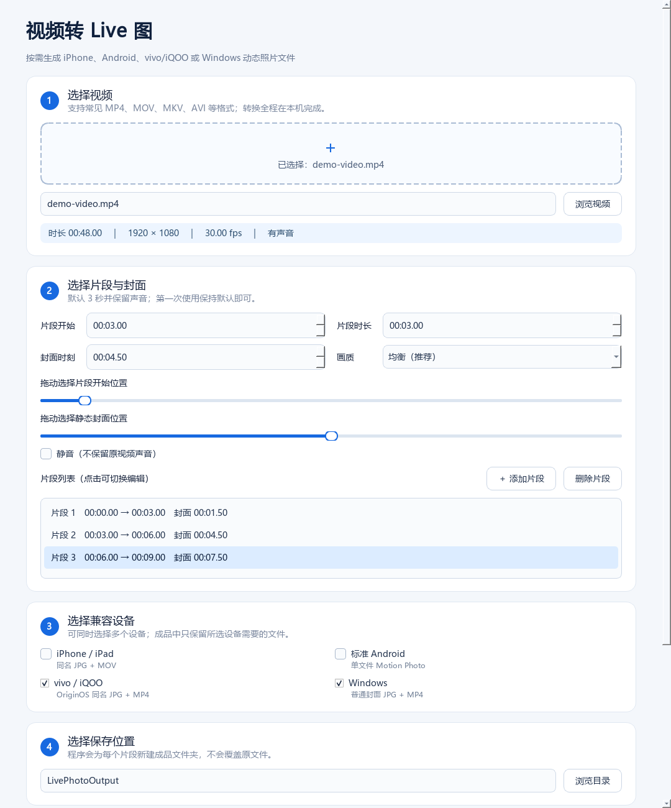

# 视频转 Live 图

一个面向普通用户的 Windows 桌面工具：选择一段视频，一次生成 iPhone Live Photo、标准 Android Motion Photo、vivo/iQOO OriginOS 动态照片，以及 Windows 通用封面和视频。

## 核心特性

- **一次生成多套格式**：无需理解不同平台的封装差异。
- **中文图形界面**：拖入视频，选择片段、封面和保存位置即可。
- **完全本地处理**：不上传视频，不依赖云服务。
- **保留声音**：默认输出 H.264/AAC，也可选择静音。
- **安全输出**：新建带时间戳的成品目录，不覆盖原文件。
- **可验证**：manifest.json 记录文件大小和 SHA-256。

## 平台兼容性

| 平台 | 输出文件 | 预期使用方式 |
|---|---|---|
| iPhone / iPad | 同名 JPG + MOV | 使用支持配对资源的照片导入工具导入为 Live Photo |
| 标准 Android | 以 MP.jpg 结尾的单文件 | 复制到 DCIM/Camera，用 Google Photos 或兼容相册打开 |
| vivo / iQOO | 同名 IMG_*.jpg + IMG_*.mp4 | 两个文件一起复制到 DCIM/Camera，使用 OriginOS 相册 |
| Windows | 普通 JPG + H.264/AAC MP4 | “照片”查看封面，“媒体播放器”播放视频 |

不同平台没有统一的动态照片容器，所以程序生成的是一个兼容包，而不是伪装成单个万能文件。详细传输方法与限制见 [兼容性说明](docs/COMPATIBILITY.md)。

## 下载与使用

普通用户建议从 [GitHub Releases](../../releases/latest) 下载最新 Windows ZIP：

1. 解压完整 ZIP，不能只复制其中的 EXE。
2. 双击“视频转Live图.exe”。
3. 拖入视频，或点击“浏览视频”。
4. 保持默认 3 秒和均衡画质，选择保存位置。
5. 点击“生成 Live 图兼容包”。

程序完成后会打开一个独立成品目录，并附带“使用说明.txt”。

## 成品文件说明

假设输入视频名为“假期.mp4”：

| 文件 | 用途 |
|---|---|
| 假期.jpg + 假期.mov | Apple Live Photo 配对 |
| 假期MP.jpg | Android Motion Photo 1.0 单文件 |
| IMG_日期_时间.jpg + 同名 MP4 | vivo/iQOO OriginOS 配对 |
| 假期_Windows封面.jpg | Windows 静态封面 |
| 假期_Windows.mp4 | Windows/安卓通用动态内容 |
| manifest.json | 文件角色、大小、哈希和转换参数 |
| 使用说明.txt | 针对各平台的传输步骤 |

配对文件不能只传其中一个，也不能修改为不同的主文件名。微信、QQ 等聊天软件可能压缩图片或丢失元数据，不适合传输原始动态照片。

## 从源码运行

要求 Windows 和 Python 3.10 或更高版本。

最简单的方法：

1. 双击“安装依赖.bat”。
2. 安装完成后双击“启动程序.bat”。

PowerShell 用户可以执行：

~~~powershell
python -m venv .venv
.\.venv\Scripts\python.exe -m pip install -r requirements-dev.txt
.\.venv\Scripts\python.exe -m livephoto
~~~

命令行转换：

~~~powershell
.\.venv\Scripts\python.exe -m livephoto convert "输入.mp4" --output "成品目录"
~~~

## 测试与构建

~~~powershell
$env:QT_QPA_PLATFORM = "offscreen"
.\.venv\Scripts\python.exe -m pytest -q
.\build_windows.ps1
~~~

构建结果位于 dist/视频转Live图。完整开发、验证和发布流程见 [开发指南](docs/DEVELOPMENT.md)。

## 项目架构

~~~text
livephoto/
├── core/       跨平台封装、FFmpeg 转码、探测与输出流水线
├── ui/         PySide6 图形界面与后台任务
├── cli.py      命令行入口
└── app.py      桌面程序入口

scripts/        校验、截图与测试视频工具
tests/          单元、流水线和 UI 测试
docs/           架构、兼容性与开发文档
~~~

架构和数据流详见 [架构说明](docs/ARCHITECTURE.md)。

## 学习资料

如果你只掌握少量 Python 基础，可以阅读 [项目源码详解与 Git/GitHub 初学者教程](docs/PROJECT_CODE_AND_GIT_GUIDE.md)。该报告按一次转换的调用链逐个解释源码、测试、打包和 CI，并系统介绍 Git 日常命令、分支、撤销、发布与本项目练习。

## 已知限制

- Android 厂商相册对 Motion Photo 的支持并不一致。
- vivo/iQOO 格式属于厂商私有实现，目前基于 iQOO Neo8 Pro 原生样本适配。
- Apple Live Photo 是否被识别，也取决于导入工具是否保留配对关系和元数据。
- Windows 没有统一识别 Apple/Android 动态照片的机制，因此提供普通 JPG 和 MP4。
- 程序不负责把文件直接写入手机相册。

## 作者与许可

作者：**杨振**

本项目采用 [Apache License 2.0](LICENSE)。允许使用、修改和商用，但再分发时必须遵守许可证并保留适用的版权、许可和 [NOTICE](NOTICE) 署名信息。

第三方组件及其许可见 [THIRD_PARTY_NOTICES.md](THIRD_PARTY_NOTICES.md)。欢迎阅读 [贡献指南](CONTRIBUTING.md) 后提交改进。
